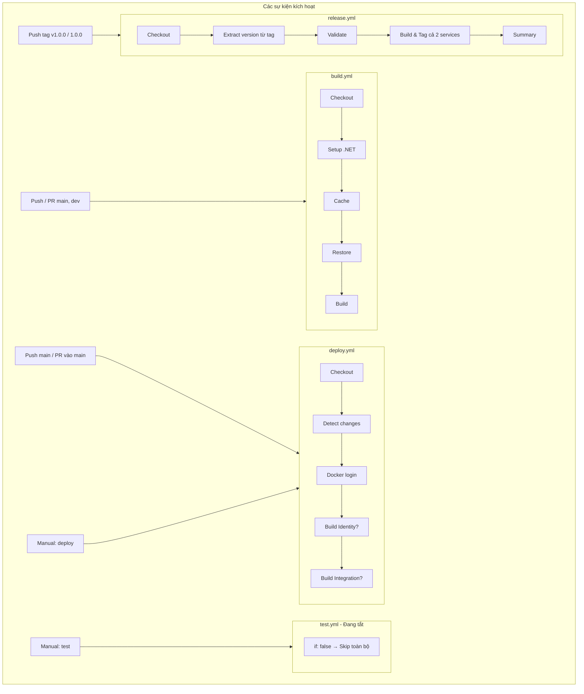

# Luồng chạy CI/CD Workflows

Tài liệu mô tả luồng chạy của các file workflow YAML trong `.github/workflows/` của dự án Beyond8.

---

## Tổng quan

| Workflow | File | Mục đích |
|----------|------|----------|
| **Build Solution** | `build.yml` | Build solution .NET khi có thay đổi code |
| **Run Tests** | `test.yml` | Chạy unit tests (hiện đang tắt) |
| **Build and Push Docker** | `deploy.yml` | Build & push Docker images lên Docker Hub khi push `main` |
| **Release and Tag** | `release.yml` | Build & tag Docker images theo version khi push tag |

---

## Deploy vs Release — Khác biệt quan trọng

| | **deploy.yml** | **release.yml** |
|---|----------------|-----------------|
| **Khi nào chạy?** | Bạn **git push code** (vd: `git push origin main`) là nó chạy. | Bạn git push code bình thường **không** chạy. |
| **Trigger** | Push branch `main` (có thay đổi trong `src`/`shared`/`docker`/…) hoặc manual. | **Chỉ** khi bạn đẩy **một cái tag** lên, ví dụ: `git push origin v1.0.0`. |
| **Ví dụ** | `git add .` → `git commit` → `git push origin main` → **deploy** chạy. | `git tag v1.0.0` → `git push origin v1.0.0` → **release** chạy. |

**Tóm lại:**  
- **deploy** = push **code** (branch) → build & push Docker.  
- **release** = push **tag** (vd: `v1.0.0`) → build & tag Docker theo version.

---

## Sơ đồ luồng tổng thể



---

## 1. Build Solution (`build.yml`)

### Khi nào chạy

| Sự kiện | Điều kiện |
|---------|-----------|
| **Push** | Branch `main` hoặc `dev`, thay đổi trong `src/**`, `shared/**`, `*.sln` hoặc chính `build.yml` |
| **Pull Request** | Target branch `main` hoặc `dev`, thay đổi trong `src/**`, `shared/**`, `*.sln` |

### Luồng chạy

```
Checkout code
    ↓
Setup .NET 10.0.x
    ↓
Cache NuGet packages (key: hash của *.csproj)
    ↓
Cache build outputs (bin, obj)
    ↓
dotnet restore beyond8-server.sln
    ↓
dotnet build --no-restore --configuration Release
```

### Mục đích

- Đảm bảo solution build được sau mỗi thay đổi code
- Dùng cho PR và push lên `main`/`dev`
- Có caching để tăng tốc restore và build

---

## 2. Run Tests (`test.yml`)

### Khi nào chạy

| Sự kiện | Điều kiện |
|---------|-----------|
| **workflow_dispatch** | Chỉ chạy khi bấm "Run workflow" thủ công |

### Luồng chạy

```
Job test chạy? → if: false → KHÔNG CHẠY (skip toàn bộ job)
```

**Khi bật lại** (sửa `if: false` → xóa hoặc `if: true`), các bước sẽ là:

```
Checkout code
    ↓
Setup .NET 10.0.x
    ↓
Cache NuGet packages
    ↓
dotnet restore
    ↓
dotnet test --collect:"XPlat Code Coverage"
```

### Lưu ý

- Hiện **đang tắt** (`if: false`) vì chưa có test
- Chỉ dùng manual trigger
- Khi có test, bỏ `if: false` và có thể thêm trigger `push`/`pull_request` nếu cần

---

## 3. Build and Push Docker (`deploy.yml`)

### Khi nào chạy

| Sự kiện | Điều kiện |
|---------|-----------|
| **Push** | Branch `main`, thay đổi trong `src/**`, `shared/**`, `docker/**`, `*.sln` hoặc `deploy.yml` |
| **Pull Request** | Target branch `main`, thay đổi trong `src/**`, `shared/**`, `docker/**`, `*.sln` hoặc `deploy.yml` |
| **workflow_dispatch** | Chạy thủ công |

### Luồng chạy

```
Checkout (fetch-depth: 0 để detect changes)
    ↓
Detect changes (paths-filter)
    ├── identity: src/Services/Identity/** hoặc shared/**
    ├── integration: src/Services/Integration/** hoặc shared/**
    ├── orchestration: src/Orchestration/**
    └── docker: docker/**, **/Dockerfile, .dockerignore
    ↓
Nếu có identity HOẶC integration HOẶC docker HOẶC manual:
    ↓
Docker login (DOCKER_USERNAME, DOCKER_PASSWORD)
    ↓
Setup Docker Buildx
    ↓
┌─────────────────────────────────────────────────────────────┐
│ Nếu identity HOẶC docker HOẶC manual:                       │
│   Extract metadata (tags: branch, sha, semver, latest)       │
│   → Build & push beyond8-identity-service                    │
│   → cache-from/to: gha, scope=identity                       │
└─────────────────────────────────────────────────────────────┘
    ↓
┌─────────────────────────────────────────────────────────────┐
│ Nếu integration HOẶC docker HOẶC manual:                    │
│   Extract metadata (tags: branch, sha, semver, latest)       │
│   → Build & push beyond8-integration-service                 │
│   → cache-from/to: gha, scope=integration                    │
└─────────────────────────────────────────────────────────────┘
```

### Smart build

- Chỉ build **Identity** khi đổi Identity hoặc shared hoặc Docker config
- Chỉ build **Integration** khi đổi Integration hoặc shared hoặc Docker config
- Manual trigger → luôn build cả hai
- Dùng **GitHub Actions cache** (scope theo từng service) để build nhanh hơn

### Docker tags (ví dụ branch `main`)

- `main`, `main-<sha>`, `latest`, semver nếu có tag

---

## 4. Release and Tag (`release.yml`)

### Khi nào chạy

| Sự kiện | Điều kiện |
|---------|-----------|
| **Push tag** | **Chỉ** khi người dùng tạo và push tag (vd: `v1.0.0`, `1.0.0`, `1.0.0-beta`) |

Workflow **chỉ** chạy khi user tạo tag và push lên repo. Không có manual trigger hay release event.

### Luồng chạy

```
User: git tag v1.0.0 && git push origin v1.0.0
    ↓
Checkout (fetch-depth: 0)
    ↓
Extract version từ tag (github.ref_name)
    - Bỏ prefix "v" nếu có (v1.0.0 → 1.0.0)
    - Xác định is_prerelease (1.0.0-beta → true)
    ↓
Validate version (X.Y.Z hoặc X.Y.Z-prerelease)
    ↓
Docker login → Setup Buildx
    ↓
Build & push Identity
    - Tags: version, major.minor, major, latest (chỉ khi không phải prerelease)
    - build-args: VERSION=<version>
    ↓
Build & push Integration
    - Cùng cách tag và VERSION
    ↓
Ghi Summary (tag, version, danh sách images đã push)
```

### Version & tags

- **Tag do user tạo**: `v1.0.0`, `1.0.0`, `1.0.0-beta` (format được validate)
- **Docker tags**: `1.0.0`, `1.0`, `1`, `latest` (latest chỉ khi stable, không phải prerelease)
- **Git tag**: User tự tạo và push; workflow không tạo tag.

### Khác với `deploy.yml`

| | deploy.yml | release.yml |
|---|------------|-------------|
| **Trigger** | Push `main`, manual | **Chỉ** push tag |
| **Build** | Chỉ service thay đổi (có thể 1 hoặc 2) | Luôn cả Identity + Integration |
| **Tags** | branch, sha, latest | version, major.minor, major, latest |
| **Git tag** | Không | User tự tạo; workflow không tạo |
| **Version** | Không dùng | Lấy từ tag, dùng cho Docker tags + build-args |

---

## Quan hệ giữa các workflow

- **build** và **deploy** đều có thể chạy khi push `main`, nhưng **độc lập** (không phụ thuộc nhau).
- **deploy** chỉ chạy khi push `main`; **build** chạy cả khi push `main`/`dev` và khi mở PR.
- **release** chỉ chạy khi user **push tag** (vd: `v1.0.0`); không chạy khi push branch hay manual.
- **test** hiện không chạy; khi bật lại có thể chạy song song với build hoặc trước deploy tùy cách bạn cấu hình.

---

## Secrets cần cấu hình

Chỉ **deploy** và **release** dùng secrets:

| Secret | Dùng trong | Mô tả |
|--------|------------|-------|
| `DOCKER_USERNAME` | deploy, release | Username Docker Hub |
| `DOCKER_PASSWORD` | deploy, release | Password hoặc Access Token Docker Hub |

Cấu hình tại: **Settings → Secrets and variables → Actions**.

---

## Tóm tắt nhanh

| Hành động | Workflow chạy |
|-----------|----------------|
| Push/PR đổi `src` hoặc `shared` | **build** |
| Push `main` hoặc PR vào `main` đổi `src`/`shared`/`docker` | **build** + **deploy** |
| Push tag (vd: v1.0.0, 1.0.0) | **release** |
| Manual "Run workflow" deploy | **deploy** |
| Manual "Run workflow" test | **test** (hiện bị skip) |

---

*Cập nhật theo các workflow tại `.github/workflows/`.*
