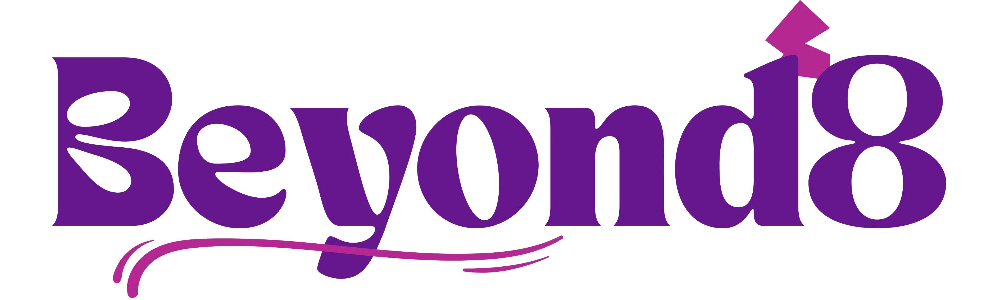

<p align="center">
  
</p>

# Beyond8 Server
Backend microservices cho nền tảng học trực tuyến Beyond8 — xây dựng bằng ASP.NET Core, .NET Aspire và Clean Architecture.

## 📋 Mục lục

- [Giới thiệu](#-giới-thiệu)
- [Tổng quan Source Code](#-tổng-quan-source-code)
- [Hướng dẫn Chạy Code Trực tiếp](#-hướng-dẫn-chạy-code-trực-tiếp)
- [Hướng dẫn Chạy Docker](#-hướng-dẫn-chạy-docker)

---

## 📖 Giới thiệu

Beyond8 Server là hệ thống backend dạng microservices, mỗi service phụ trách một nghiệp vụ riêng:

| Service | Mô tả |
|--------|--------|
| **Identity** | Xác thực, phân quyền, quản lý người dùng (Admin, Staff, Instructor, Student) |
| **Integration** | Media, AI (chấm bài, gợi ý), thông báo (FCM), email, eKYC |
| **Catalog** | Danh mục khóa học, bài học, chương trình |
| **Assessment** | Quiz, bài tập, chấm điểm (thủ công & AI) |
| **Learning** | Ghi danh, tiến độ học, chứng chỉ |
| **Sale** | Đơn hàng, thanh toán (VNPay), coupon, ví |
| **Analytic** | Thống kê, báo cáo (stub) |

**Công nghệ chính:** ASP.NET Core, .NET Aspire, PostgreSQL, Redis, RabbitMQ (MassTransit), JWT, Entity Framework Core, Minimal API.

---

## 🗂 Tổng quan Source Code

```
beyond8-server/
├── src/
│   ├── Orchestration/
│   │   ├── Beyond8.AppHost/              # Host Aspire — chạy toàn bộ services + dependencies
│   │   └── Beyond8.ServiceDefaults/      # Cấu hình mặc định (logging, resilience, ...)
│   └── Services/
│       ├── Identity/                     # *.Api, *.Application, *.Domain, *.Infrastructure
│       ├── Integration/
│       ├── Catalog/
│       ├── Assessment/
│       ├── Learning/
│       ├── Sale/
│       └── Analytic/
├── shared/
│   ├── Beyond8.Common/                   # DTO, events, hằng số dùng chung
│   └── Beyond8.DatabaseMigrationHelpers/ # Hỗ trợ migration
├── docker/
│   ├── docker-compose-dev.yml            # Dev: build từ source + Aspire Dashboard
│   ├── docker-compose-prod.yml           # Prod: dùng image sẵn
│   └── .env.example                      # Biến môi trường mẫu
└── beyond8-server.sln
```

Mỗi service tuân theo **Clean Architecture** với 4 lớp:

- **Domain**: Entity, interface repository, enum, quy tắc nghiệp vụ
- **Application**: DTO, service interface/implementation, validation
- **Infrastructure**: DbContext, repository, tích hợp ngoại vi (DB, cache, message queue)
- **Api**: Minimal API, middleware, Swagger/OpenAPI

---

## 🚀 Hướng dẫn Chạy Code Trực tiếp

### Yêu cầu

- [.NET 10 SDK](https://dotnet.microsoft.com/download)
- PostgreSQL, Redis, RabbitMQ (chạy local hoặc qua Docker — xem phần Docker bên dưới để chỉ chạy hạ tầng)

### Chạy bằng .NET Aspire (khuyến nghị)

Aspire AppHost sẽ tự đứng PostgreSQL, Redis, RabbitMQ (và Qdrant nếu cần), rồi chạy tất cả các service.

1. Mở solution và đặt **Beyond8.AppHost** làm startup project.

2. Chạy AppHost:

   ```bash
   cd src/Orchestration/Beyond8.AppHost
   dotnet run
   ```

3. Truy cập:
   - **Aspire Dashboard**: URL in trên console (thường `http://localhost:15xxx`) — xem trạng thái services, logs, tracing.
   - **Các API**: qua dashboard hoặc URL từng service (port được Aspire gán tự động).

4. Cấu hình nhạy cảm (JWT, DB, API bên ngoài, ...) đặt trong **User Secrets** của AppHost hoặc `appsettings.Development.json` (không commit secret thật).

### Chạy từng service riêng lẻ

- Mở từng project `Beyond8.*.Api` làm startup.
- Cấu hình `appsettings.Development.json` (connection string tới PostgreSQL, Redis, RabbitMQ đang chạy).
- Chạy: `dotnet run` trong thư mục project Api tương ứng.

---

## 🐳 Hướng dẫn Chạy Docker

### Môi trường Development (`docker-compose-dev.yml`)

- Build image từ source, dùng biến môi trường từ file `.env`.
- Bao gồm Aspire Dashboard, PostgreSQL, Redis, RabbitMQ, Qdrant, Gateway (nginx), và tất cả các service.

**Bước 1:** Tạo file biến môi trường

```bash
cd docker
cp .env.example .env
# Chỉnh .env: JWT, DB password, Redis, RabbitMQ, API keys (AWS, Gemini, Resend, VNPay, ...)
```

**Bước 2:** Chạy toàn bộ stack

```bash
docker compose -f docker-compose-dev.yml --env-file .env up -d
```

- **Gateway**: `http://localhost:8080` (hoặc port trong `.env`: `GATEWAY_PORT`)
- **Aspire Dashboard**: port `18888` (UI) và `18889` (OTLP) — xem trong `.env` nếu đổi.
- **Các service** có thể truy cập qua gateway hoặc trực tiếp qua port riêng (ví dụ Identity `8081`, Integration `8082`, ...).

**Dừng:**

```bash
docker compose -f docker-compose-dev.yml down
```

### Môi trường Production (`docker-compose-prod.yml`)

- Dùng image build sẵn (ví dụ `ngothanhdatak/beyond8-identity-service:latest`).
- Không có Aspire Dashboard; có thêm Adminer cho quản lý DB.

**Chạy:**

```bash
cd docker
cp .env.example .env
# Điền đầy đủ biến môi trường cho production
docker compose -f docker-compose-prod.yml --env-file .env up -d
```

### Các biến môi trường quan trọng (xem đầy đủ trong `docker/.env.example`)

| Nhóm | Biến ví dụ |
|------|------------|
| **JWT** | `JWT_BEARER_SECRET_KEY` |
| **PostgreSQL** | `POSTGRES_USER`, `POSTGRES_PASSWORD`, `*_SERVICE_DATABASE` |
| **Redis** | `REDIS_PASSWORD` |
| **RabbitMQ** | `RABBITMQ_USER`, `RABBITMQ_PASSWORD` |
| **Aspire (dev)** | `ASPIRE_DASHBOARD_OTLP_API_KEY` |
| **VNPay** | `VNPAY_TMN_CODE`, `VNPAY_HASH_SECRET`, `VNPAY_*_URL` |
| **AWS / AI / Email** | `AWS_*`, `GEMINI_*`, `RESEND_*`, … |

---

Để nắm rõ convention API, validation, event, cấu trúc từng layer và quy ước code, xem thêm **[CLAUDE.md](./CLAUDE.md)**.
