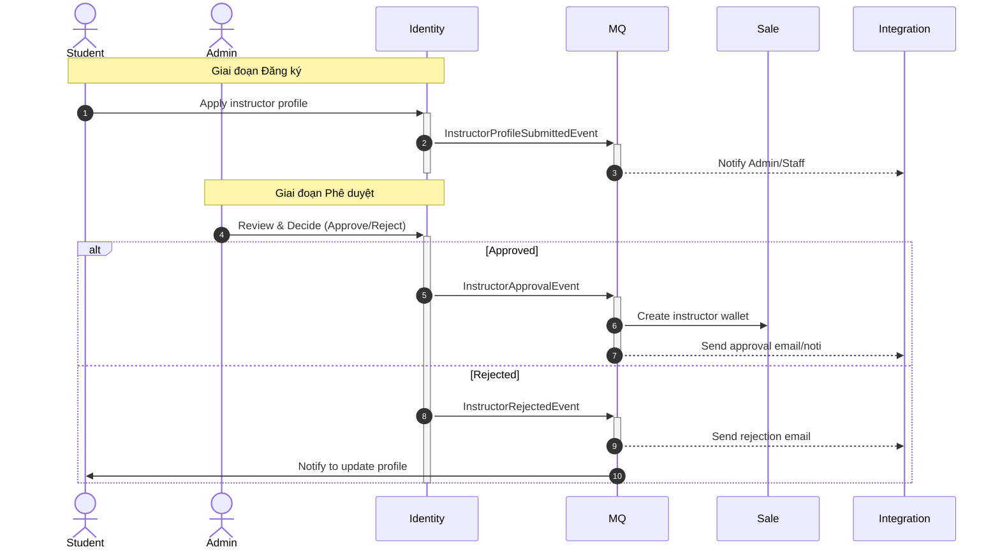
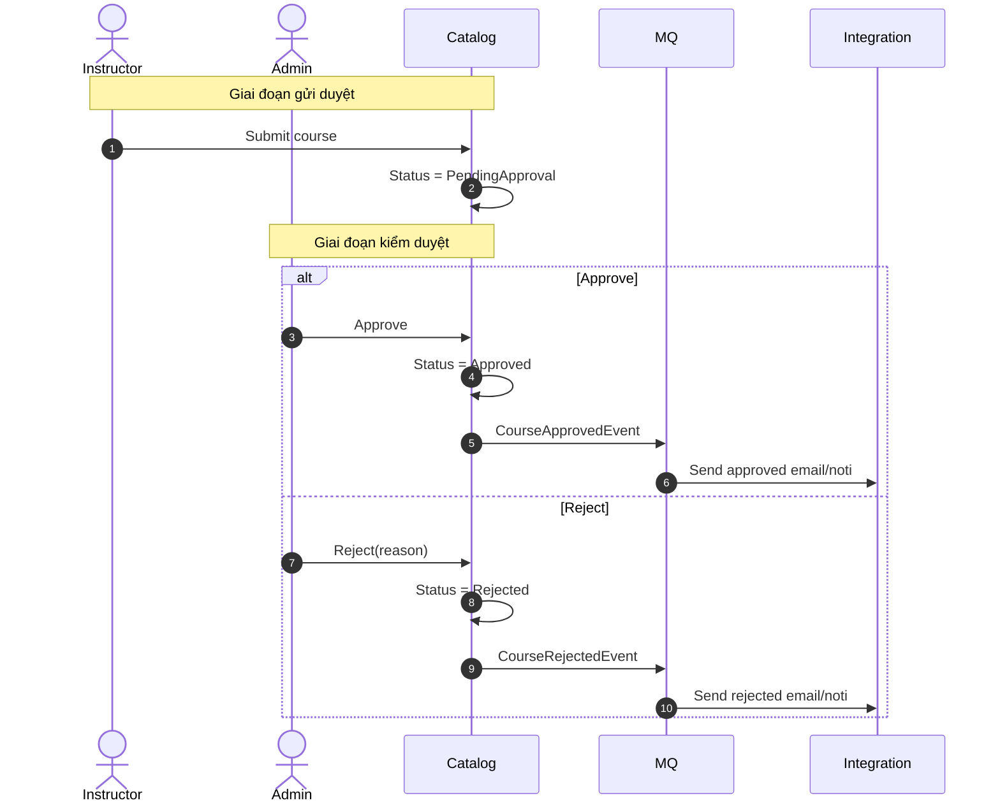
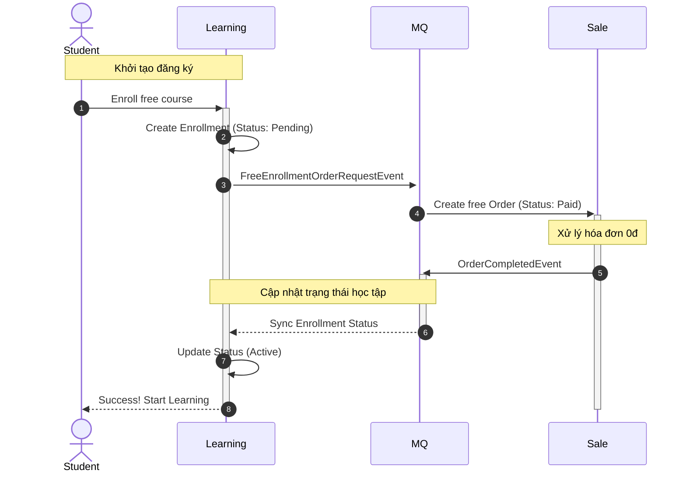
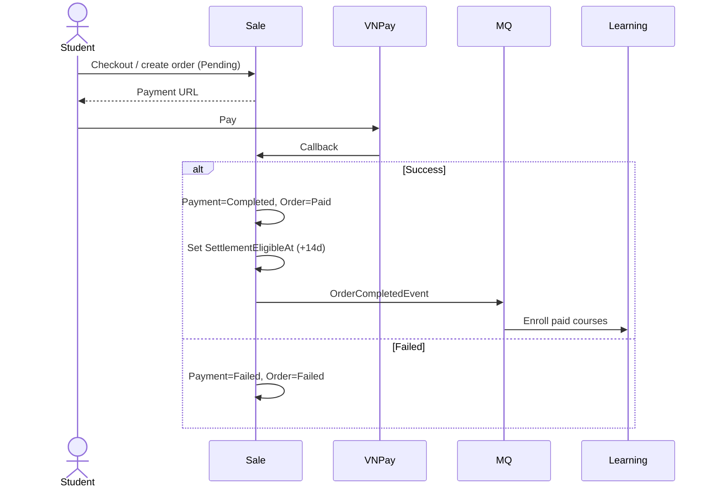
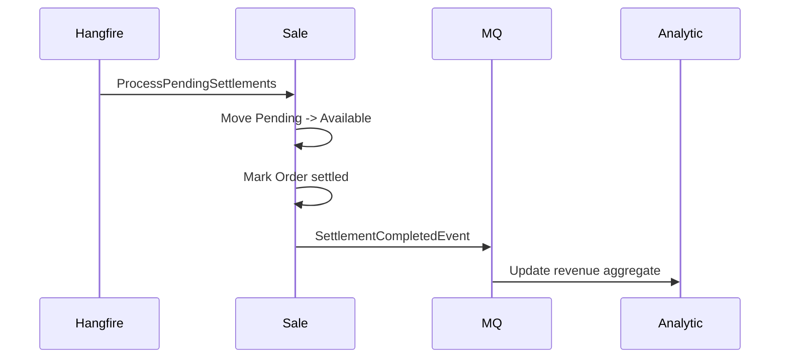
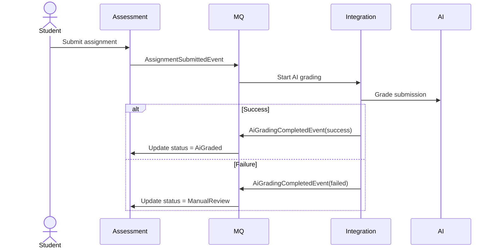
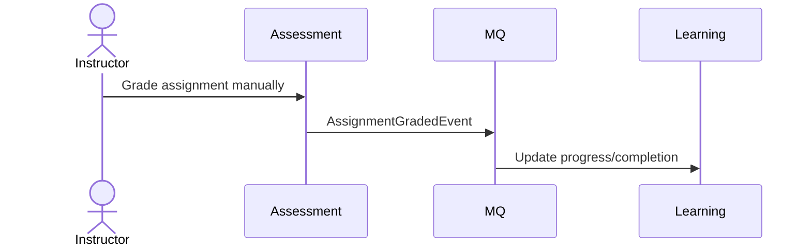
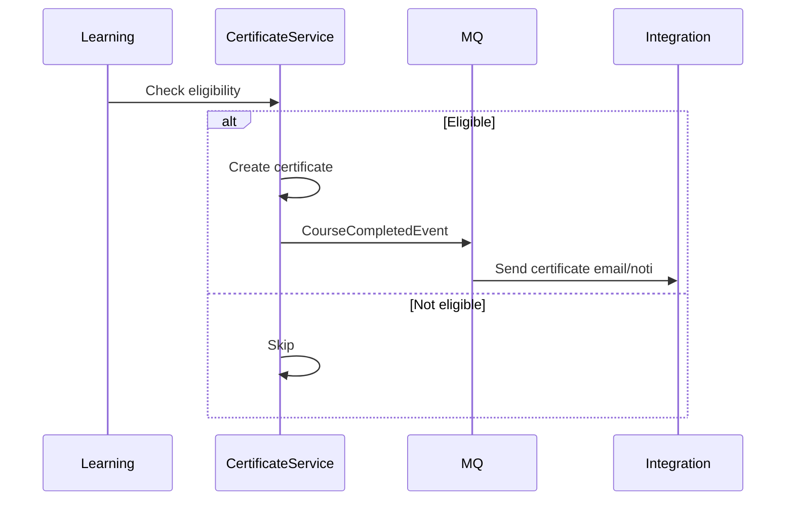
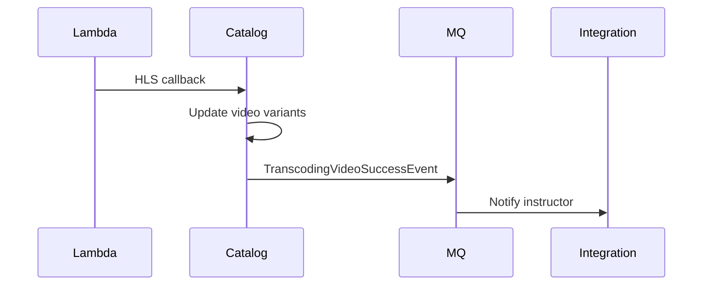

# As-Built Sequence Diagrams (Draw.io) - Simplified

Bản này tối giản để dễ đọc khi vẽ trên draw.io.

> Lưu ý:
>
> - Mỗi lần paste 1 block Mermaid.
> - Paste từ `sequenceDiagram` (không kèm `mermaid ... `).

---

## 1) Instructor Apply -> Approve/Reject

---

## 2) Course Review Flow

---

## 3) Free Enrollment

---

## 4) Paid Checkout + VNPay Callback

---

## 5) Settlement Job (Hourly)

---

## 7) Assignment AI Grading (Async)

---

## 8) Manual Grading

---

## 9) Certificate Issuance

---

## 10) Video Callback

