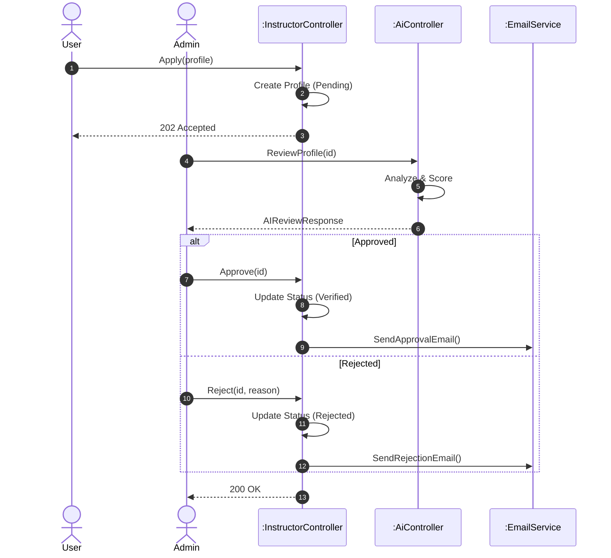
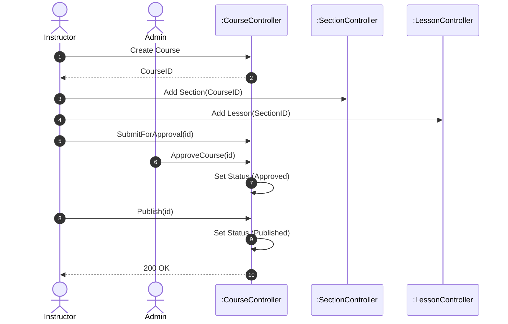
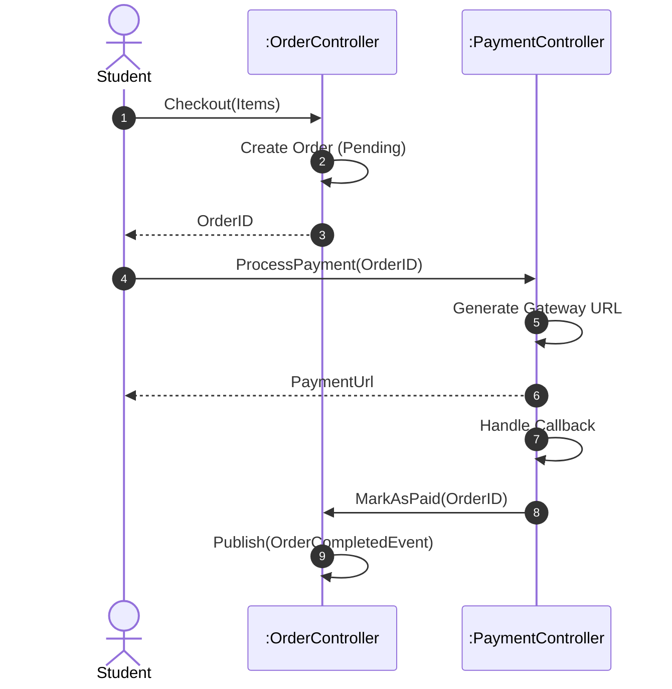
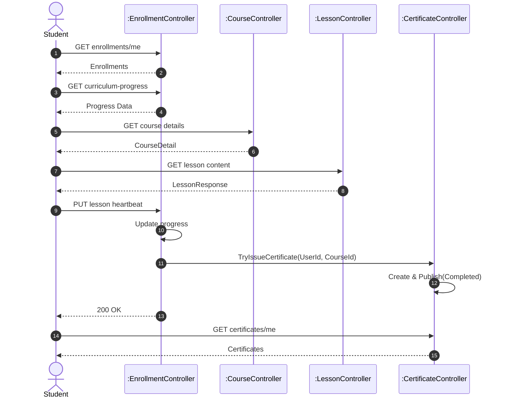

---

## 1. Instructor Registration & AI Approval

```mermaid
sequenceDiagram
    autonumber
    actor User
    actor Admin
    participant IC as :InstructorController
    participant AC as :AiController
    participant ES as :EmailService

    User->>IC: Apply(profile)
    IC->>IC: Create Profile (Pending)
    IC-->>User: 202 Accepted

    Admin->>AC: ReviewProfile(id)
    AC->>AC: Analyze & Score
    AC-->>Admin: AIReviewResponse

    alt Approved
        Admin->>IC: Approve(id)
        IC->>IC: Update Status (Verified)
        IC->>ES: SendApprovalEmail()
    else Rejected
        Admin->>IC: Reject(id, reason)
        IC->>IC: Update Status (Rejected)
        IC->>ES: SendRejectionEmail()
    end
    IC-->>Admin: 200 OK

```

---

## 2. Course Lifecycle

```mermaid
sequenceDiagram
    autonumber
    actor Instructor
    actor Admin
    participant CC as :CourseController
    participant SC as :SectionController
    participant LC as :LessonController

    Instructor->>CC: Create Course
    CC-->>Instructor: CourseID
    Instructor->>SC: Add Section(CourseID)
    Instructor->>LC: Add Lesson(SectionID)

    Instructor->>CC: SubmitForApproval(id)
    Admin->>CC: ApproveCourse(id)
    CC->>CC: Set Status (Approved)

    Instructor->>CC: Publish(id)
    CC->>CC: Set Status (Published)
    CC-->>Instructor: 200 OK

```

---

## 3. Student Purchases Course

```mermaid
sequenceDiagram
    autonumber
    actor Student
    participant OC as :OrderController
    participant PC as :PaymentController

    Student->>OC: Checkout(Items)
    OC->>OC: Create Order (Pending)
    OC-->>Student: OrderID

    Student->>PC: ProcessPayment(OrderID)
    PC->>PC: Generate Gateway URL
    PC-->>Student: PaymentUrl

    PC->>PC: Handle Callback
    PC->>OC: MarkAsPaid(OrderID)
    OC->>OC: Publish(OrderCompletedEvent)

```

---

## 4. Learning & Certification

```mermaid
sequenceDiagram
    autonumber
    actor Student
    participant EC as :EnrollmentController
    participant CC as :CourseController
    participant LC as :LessonController
    participant CertC as :CertificateController

    Student->>EC: GET enrollments/me
    EC-->>Student: Enrollments

    Student->>EC: GET curriculum-progress
    EC-->>Student: Progress Data

    Student->>CC: GET course details
    CC-->>Student: CourseDetail

    Student->>LC: GET lesson content
    LC-->>Student: LessonResponse

    Student->>EC: PUT lesson heartbeat
    EC->>EC: Update progress
    EC->>CertC: TryIssueCertificate(UserId, CourseId)
    CertC->>CertC: Create & Publish(Completed)
    EC-->>Student: 200 OK

    Student->>CertC: GET certificates/me
    CertC-->>Student: Certificates

```

---
