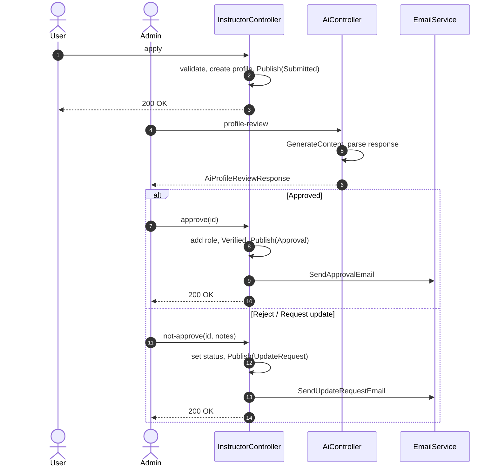
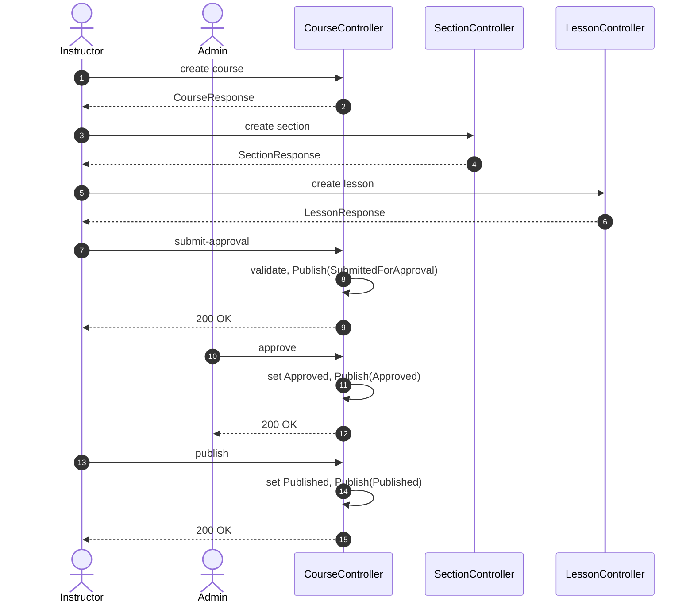
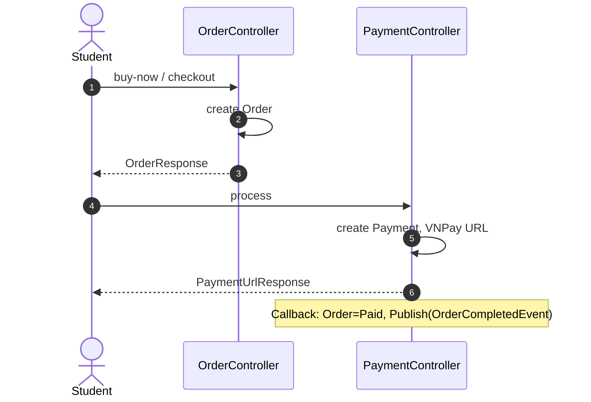
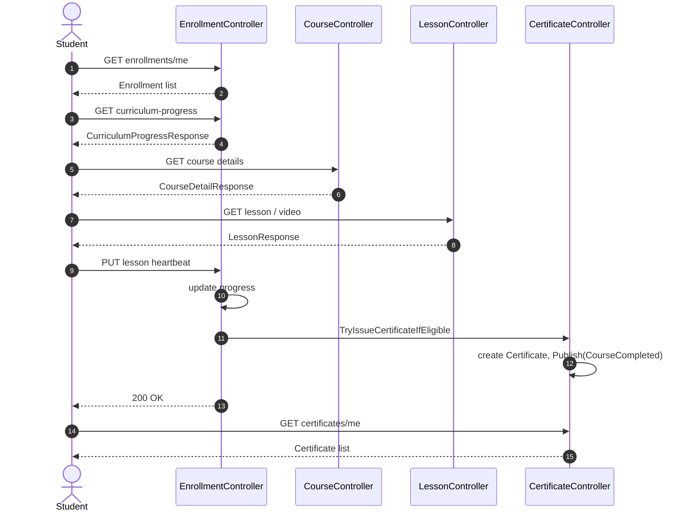

# Sequence Diagrams (Mermaid)

Tham chiếu: [UML Sequence Diagram – Visual Paradigm](https://www.visual-paradigm.com/guide/uml-unified-modeling-language/what-is-sequence-diagram/).  
Quy ước: **Actor**, **Lifeline** (participant), **Call** (->>), **Return** (-->>). Paste từng block vào `sequenceDiagram`.

---

## 1. Instructor registration and approval

User nộp hồ sơ → Admin AI review → Admin duyệt/từ chối → EmailService gửi mail.

---

## 2. Course lifecycle: create, submit, approve, publish

Instructor tạo course → section → lesson → submit. Admin approve. Instructor publish.

---

## 3. Student purchases course

Student tạo order → thanh toán → callback: Order=Paid, Publish(OrderCompletedEvent).

---

## 4. Student learns course and certificate

Student: enrollments, curriculum progress, course/lesson, heartbeat. Hệ thống: thử cấp certificate. Student: lấy certificates.

