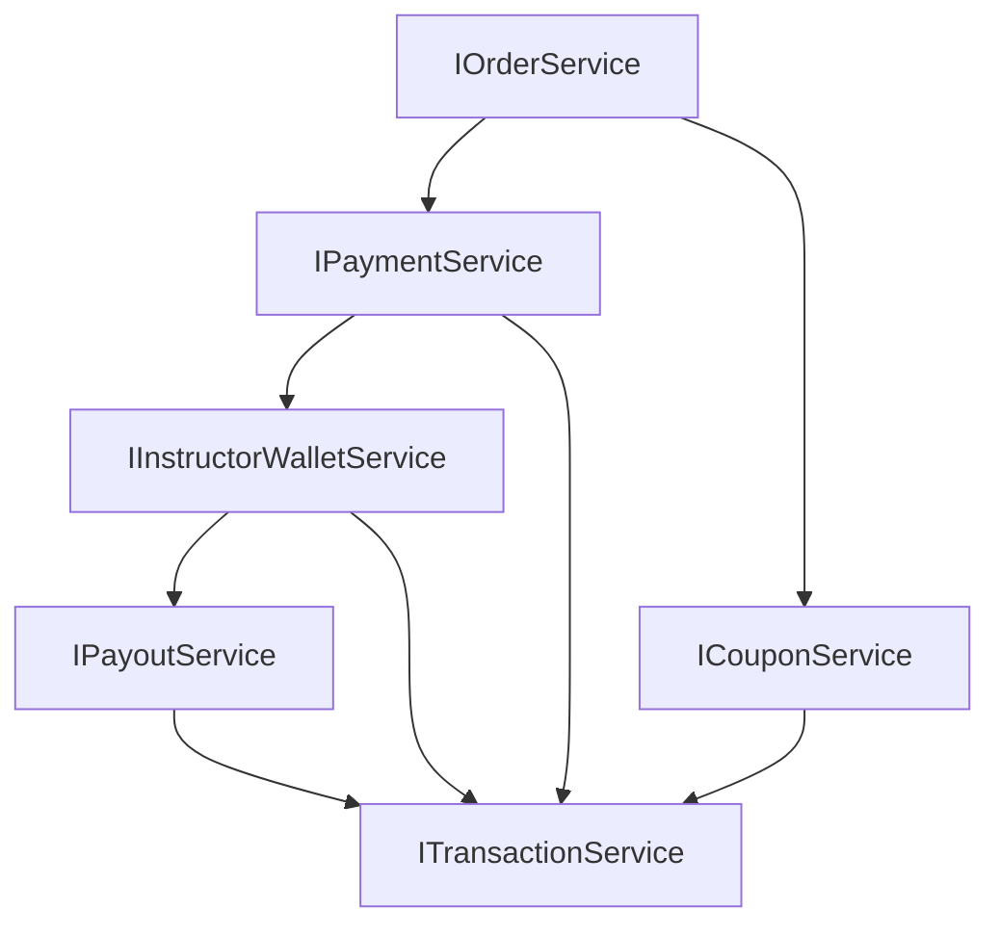

# Sale Service Implementation Plan

## 📋 Tổng quan Implementation

Sale Service là một microservice quan trọng trong hệ thống Beyond8, xử lý tất cả các hoạt động thương mại bao gồm:

- Quản lý đơn hàng (Orders)
- Xử lý thanh toán (Payments)
- Quản lý mã giảm giá (Coupons)
- Ví giảng viên (Instructor Wallets)
- Thanh toán cho giảng viên (Payouts)
- Ghi log giao dịch (Transactions)

## 🎯 Thứ tự Ưu tiên Triển khai

### 1️⃣ IOrderService (Ưu tiên cao nhất - Core functionality)

**Lý do:** Đây là service cốt lõi, tất cả flow khác phụ thuộc vào Order

#### Chức năng chính:

- ✅ Tạo đơn hàng từ cart
- ✅ Quản lý trạng thái đơn hàng
- ✅ Hủy đơn hàng

#### Dependencies:

- Chỉ phụ thuộc vào repositories cơ bản
- Không phụ thuộc vào services khác

#### Implementation Steps:

1. Tạo `OrderService` class implement `IOrderService`
2. Implement CRUD operations cho Order entity
3. Thêm business logic cho order status transitions
4. Test với data sample

---

### 2️⃣ IPaymentService (Ưu tiên cao - Critical path)

**Lý do:** Thanh toán là bước tiếp theo ngay sau tạo order

#### Chức năng chính:

- ✅ Tích hợp VNPay gateway
- ✅ Xử lý webhooks và confirmations
- ✅ Refund processing

#### Dependencies:

- Phụ thuộc vào `IOrderService` (cần order để thanh toán)
- Cần VNPay SDK/API integration

#### Implementation Steps:

1. Tạo `PaymentService` class implement `IPaymentService`
2. Implement VNPay payment URL generation
3. Handle payment confirmations và webhooks
4. Implement refund logic
5. Test với VNPay sandbox environment

---

### 3️⃣ ICouponService (Ưu tiên trung bình - Có thể parallel)

**Lý do:** Coupon có thể áp dụng trong lúc tạo order hoặc riêng biệt

#### Chức năng chính:

- ✅ Tạo/sửa/xóa coupon
- ✅ Validate và áp dụng coupon cho order

#### Dependencies:

- Có thể độc lập, hoặc integrate với `IOrderService`
- Có thể implement parallel với OrderService

#### Implementation Steps:

1. Tạo `CouponService` class implement `ICouponService`
2. Implement CRUD operations cho Coupon entity
3. Thêm validation logic cho coupon codes
4. Implement coupon application logic
5. Test với various coupon scenarios

---

### 4️⃣ IInstructorWalletService (Ưu tiên trung bình - Sau payment)

**Lý do:** Ví instructor cập nhật sau khi có doanh thu từ payment

#### Chức năng chính:

- ✅ Quản lý số dư ví
- ✅ Thêm/trừ tiền từ sales

#### Dependencies:

- Phụ thuộc vào `IPaymentService` (cần payment thành công)
- Cần events từ payment completion

#### Implementation Steps:

1. Tạo `InstructorWalletService` class implement `IInstructorWalletService`
2. Implement wallet balance management
3. Handle revenue distribution logic
4. Listen to payment success events
5. Test với mock payment data

---

### 5️⃣ IPayoutService (Ưu tiên thấp - End of flow)

**Lý do:** Rút tiền là bước cuối, sau khi có tiền trong ví

#### Chức năng chính:

- ✅ Tạo yêu cầu rút tiền
- ✅ Approve/reject payouts

#### Dependencies:

- Phụ thuộc vào `IInstructorWalletService`
- Cần bank transfer integration

#### Implementation Steps:

1. Tạo `PayoutService` class implement `IPayoutService`
2. Implement payout request workflow
3. Add admin approval logic
4. Integrate với bank transfer APIs
5. Test với sandbox bank accounts

---

### 6️⃣ ITransactionService (Ưu tiên thấp - Logging/Analytics)

**Lý do:** Ghi log giao dịch cho tất cả operations, có thể làm cuối

#### Chức năng chính:

- ✅ Ghi log tất cả transactions
- ✅ Báo cáo revenue

#### Dependencies:

- Phụ thuộc vào tất cả services khác để log events
- Có thể implement cuối cùng

#### Implementation Steps:

1. Tạo `TransactionService` class implement `ITransactionService`
2. Implement transaction logging
3. Add reporting và analytics features
4. Integrate với tất cả other services
5. Test với comprehensive transaction data

## 📈 Workflow Dependencies



## 💡 Khuyến nghị Implementation

### Phase 1: Core Foundation

1. **Bắt đầu với IOrderService** - Test với data sample
2. **Tiếp theo IPaymentService** - Integrate VNPay sandbox

### Phase 2: Parallel Development

3. **Parallel với ICouponService** - Nếu team có nhiều người

### Phase 3: Revenue Management

4. **Sau đó IInstructorWalletService** - Khi payment flow hoàn chỉnh

### Phase 4: Finalization

5. **Cuối cùng IPayoutService & ITransactionService** - Khi core flows ổn

## ✅ Benefits của Thứ tự này

- **Minimal Dependencies**: Mỗi service có thể test độc lập
- **Incremental Testing**: Có thể deploy và test từng phần
- **Risk Mitigation**: Core functionality được đảm bảo trước
- **Parallel Development**: Coupon service có thể làm song song
- **Business Value**: Payment flow hoàn chỉnh sớm

## 🚀 Next Steps

1. Bắt đầu implement `OrderService` với basic CRUD
2. Setup VNPay integration cho `PaymentService`
3. Tạo unit tests cho từng service
4. Implement API endpoints theo thứ tự
5. Integration testing giữa các services

## 📋 ClickUp Tasks

### 🔥 **PHASE 1: CORE FOUNDATION (Ưu tiên Cao)**

#### **1. IOrderService Implementation**

```
[BE] Implement CreateOrderAsync - Tạo đơn hàng từ cart với validation và coupon áp dụng
[BE] Implement GetOrderByIdAsync - Lấy thông tin chi tiết đơn hàng theo ID
[BE] Implement UpdateOrderStatusAsync - Cập nhật trạng thái đơn hàng (Pending->Paid->Completed)
[BE] Implement CancelOrderAsync - Hủy đơn hàng với business rules validation
[BE] Implement GetOrdersByUserAsync - Lấy danh sách đơn hàng của user với pagination
[BE] Implement GetOrdersByInstructorAsync - Lấy đơn hàng chứa courses của instructor
```

#### **2. IPaymentService Implementation**

```
[BE] Implement ProcessPaymentAsync - Tích hợp VNPay gateway, tạo payment URL
[BE] Implement ConfirmPaymentAsync - Xử lý webhook confirm từ VNPay
[BE] Implement RefundPaymentAsync - Xử lý hoàn tiền với VNPay API
[BE] Implement GetPaymentsByOrderAsync - Lấy lịch sử thanh toán của đơn hàng
[BE] Implement GetPaymentsByUserAsync - Lấy lịch sử thanh toán của user
```

### 🔄 **PHASE 2: PARALLEL DEVELOPMENT (Ưu tiên Trung bình)**

#### **3. ICouponService Implementation**

```
[BE] Implement CreateCouponAsync - Tạo coupon với validation (code unique, type, value)
[BE] Implement GetCouponByCodeAsync - Lấy coupon theo code để validate
[BE] Implement UpdateCouponAsync - Cập nhật thông tin coupon
[BE] Implement DeleteCouponAsync - Xóa coupon (soft delete)
[BE] Implement GetCouponsAsync - Lấy danh sách coupon cho admin management
[BE] Implement ApplyCouponAsync - Validate và tính toán giảm giá cho order
```

### 💰 **PHASE 3: REVENUE MANAGEMENT (Ưu tiên Trung bình)**

#### **4. IInstructorWalletService Implementation**

```
[BE] Implement GetWalletByInstructorAsync - Lấy thông tin ví và số dư
[BE] Implement AddFundsAsync - Thêm tiền vào ví từ sales revenue
[BE] Implement DeductFundsAsync - Trừ tiền từ ví cho payouts
[BE] Implement GetWalletTransactionsAsync - Lịch sử giao dịch ví
```

### 🏦 **PHASE 4: FINALIZATION (Ưu tiên Thấp)**

#### **5. IPayoutService Implementation**

```
[BE] Implement CreatePayoutRequestAsync - Tạo yêu cầu rút tiền với validation
[BE] Implement GetPayoutRequestByIdAsync - Lấy chi tiết payout request
[BE] Implement ApprovePayoutRequestAsync - Admin approve payout và transfer tiền
[BE] Implement RejectPayoutRequestAsync - Admin reject với lý do
[BE] Implement GetPayoutRequestsAsync - Admin xem tất cả payout requests
[BE] Implement GetPayoutRequestsByInstructorAsync - Instructor xem lịch sử payouts
```

#### **6. ITransactionService Implementation**

```
[BE] Implement CreateTransactionAsync - Ghi log tất cả giao dịch
[BE] Implement GetTransactionByIdAsync - Lấy chi tiết transaction
[BE] Implement GetTransactionsByUserAsync - Lịch sử giao dịch của user
[BE] Implement GetAllTransactionsAsync - Admin xem tất cả transactions
[BE] Implement GetTotalRevenueAsync - Báo cáo doanh thu theo khoảng thời gian
```

---

_Document created: February 5, 2026_
_Author: Beyond8 Development Team_</content>
<parameter name="filePath">d:\ChuyenNganh7\SWD392\Beyond8\beyond8-server\docs\sale-service-implementation-plan.md
